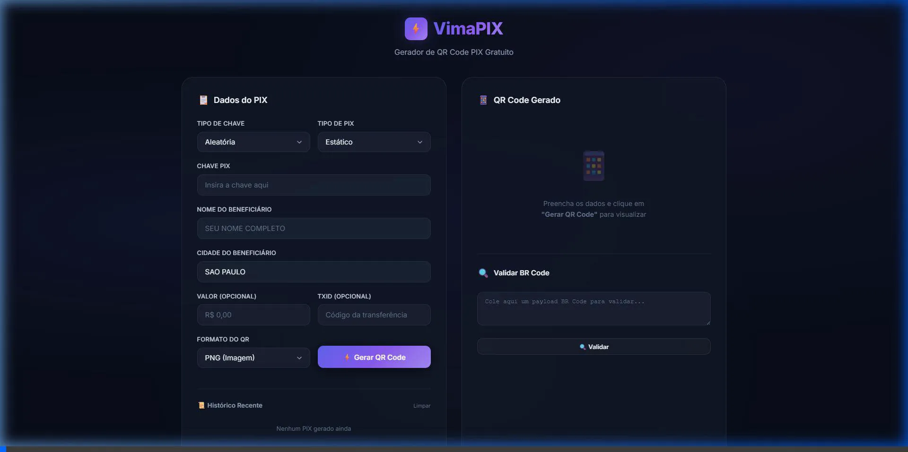

# VimaPIX - Gerador de QR Code e Payload PIX

<p align="center">
  <a href="https://github.com/reisdiegoss/vimapix">
    
  </a>
  <a href="https://hub.docker.com/r/vimasistemas/vimapix">
    
  </a>
  <a href="https://github.com/reisdiegoss/vimapix/blob/main/LICENSE">
    
  </a>
</p>

**VimaPIX** é uma aplicação Node.js completa que oferece uma interface web moderna e uma API RESTful para gerar e validar QR Codes e payloads "Copia e Cola" para transações PIX, seguindo as especificações do Banco Central do Brasil.

---

## 🎬 Demonstração

<p align="center">
  
</p>

---

## 🚀 Funcionalidades

### Interface Web

- **Dark Mode Premium:** Design moderno com glassmorphism, gradientes e micro-animações
- **Validação em Tempo Real:** Máscaras automáticas para CPF, CNPJ, E-mail e Celular
- **Prévia Instantânea:** QR Code gerado automaticamente conforme você digita
- **Download PNG/SVG:** Baixe o QR Code em formato de imagem ou vetorial
- **Histórico Local:** Últimas 10 chaves geradas salvas no navegador para reutilização rápida
- **Validador de BR Code:** Cole um payload PIX e veja os dados decodificados

### API RESTful

- **Geração de QR Code** (`POST /api/generate`): Retorna QR Code em PNG (Base64) ou SVG
- **Validação de BR Code** (`POST /api/validate`): Decodifica e valida payloads PIX (parser EMV + CRC)
- **Health Check** (`GET /health`): Status, versão e uptime do servidor
- **Documentação Interativa** (`/docs`): Swagger UI com todos os endpoints
- **PIX Estático e Dinâmico:** Suporte completo aos dois tipos de transação

### Segurança

- **Rate Limiting:** 100 requisições por IP a cada 15 minutos
- **Helmet:** Headers HTTP de segurança configurados
- **Validação com Zod:** Schemas de validação em todas as rotas

---

## 🛠️ Como Usar

### 1. Pré-requisitos

- [Node.js](https://nodejs.org/) (v18 ou superior)
- [Docker](https://www.docker.com/) (para rodar em contêiner)

### 2. Rodando Localmente

```bash
git clone https://github.com/reisdiegoss/vimapix.git
cd vimapix
npm install
npm start
```

A aplicação estará disponível em `http://localhost:3000`.

### 3. Executando com Docker

```bash
docker run -d -p 3000:3000 --name vimapix vimasistemas/vimapix:latest
```

### 4. Docker Swarm + Traefik (Produção)

Crie um arquivo `docker-stack.yml`:

```yaml
version: "3.8"

services:
  vimapix:
    image: vimasistemas/vimapix:latest
    hostname: vimapix
    networks:
      - network_public
    deploy:
      mode: replicated
      replicas: 1
      placement:
        constraints:
          - node.role == manager
      resources:
        limits:
          cpus: '0.5'
          memory: 1024M
      labels:
        - "traefik.enable=true"
        - "traefik.docker.network=network_public"
        - "traefik.http.routers.vimapix.rule=Host(`vimapix.dominio.com.br`)"
        - "traefik.http.routers.vimapix.entrypoints=websecure"
        - "traefik.http.routers.vimapix.service=vimapix-svc"
        - "traefik.http.routers.vimapix.tls=true"
        - "traefik.http.routers.vimapix.tls.certresolver=letsencryptresolver"
        - "traefik.http.services.vimapix-svc.loadbalancer.server.port=3000"

networks:
  network_public:
    external: true
```

```bash
docker stack deploy -c docker-stack.yml vimapix
```

> **Nota:** Altere `vimapix.dominio.com.br` para o seu domínio real.

---

## 📡 API Endpoints

A documentação completa e interativa está disponível em `/docs` (Swagger UI).

### `GET /health`

Retorna o status do servidor.

```json
{
  "status": "ok",
  "version": "2.0.0",
  "uptime": "3600s",
  "timestamp": "2026-03-02T18:00:00.000Z"
}
```

### `POST /api/generate`

Gera o BR Code e o QR Code.

```bash
curl -X POST http://localhost:3000/api/generate \
-H "Content-Type: application/json" \
-d '{
  "pixKey": "seu-email@provedor.com",
  "beneficiaryName": "NOME COMPLETO",
  "beneficiaryCity": "SAO PAULO",
  "amount": 19.99,
  "txid": "PEDIDO12345",
  "type": "static",
  "format": "png"
}'
```

| Campo | Tipo | Obrigatório | Descrição |
|---|---|---|---|
| `pixKey` | string | ✅ | Chave PIX |
| `beneficiaryName` | string | ✅ | Nome do beneficiário |
| `beneficiaryCity` | string | ✅ | Cidade do beneficiário |
| `amount` | number | ❌ | Valor da transação |
| `txid` | string | ❌ | Identificador da transação |
| `type` | string | ❌ | `static` ou `dynamic` (padrão: `static`) |
| `format` | string | ❌ | `png` ou `svg` (padrão: `png`) |

### `POST /api/validate`

Valida e decodifica um payload BR Code.

```bash
curl -X POST http://localhost:3000/api/validate \
-H "Content-Type: application/json" \
-d '{"brcode": "00020126..."}'
```

---

## 🐳 Dockerfile

Imagem otimizada com multi-stage build:

```dockerfile
FROM node:18-alpine AS builder
WORKDIR /usr/src/app
COPY package*.json ./
RUN npm install --only=production
COPY . .

FROM node:18-alpine
WORKDIR /usr/src/app
COPY --from=builder /usr/src/app .
EXPOSE 3000
USER node
CMD [ "node", "server.js" ]
```

---

## 🤝 Contribuindo

Contribuições são bem-vindas! Sinta-se à vontade para abrir uma *issue* ou enviar um *pull request*.

## 📄 Licença

Este projeto está sob a licença MIT. Veja o arquivo [LICENSE](LICENSE) para mais detalhes.
